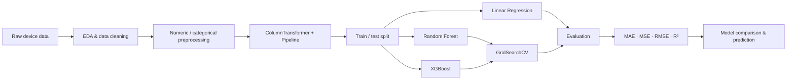

# Used Device Price Prediction


A machine learning project for predicting the price of used mobile devices from their specifications. The project covers exploratory analysis, preprocessing, reproducible modeling pipelines, hyperparameter tuning, model comparison and sample inference.

## Highlights

- End-to-end regression workflow using **Scikit-learn Pipeline + ColumnTransformer**
- Comparison of **Linear Regression**, **Random Forest** and **XGBoost**
- Hyperparameter tuning with **GridSearchCV**
- Evaluation with **MAE, MSE, RMSE and R²**
- Best test result: **XGBoost — R² = 0.8495, RMSE = 0.2260**

## Machine Learning Workflow



## Tech Stack

| Area | Tools |
|---|---|
| Language | Python |
| Data | Pandas, NumPy |
| Visualization | Matplotlib, Seaborn |
| Machine Learning | Scikit-learn, XGBoost |
| Model Selection | GridSearchCV |
| Environment | Jupyter Notebook |

## Results

| Model | MAE | MSE | RMSE | R² |
|---|---:|---:|---:|---:|
| **XGBoost** | **0.1794** | **0.0511** | **0.2260** | **0.8495** |
| Random Forest | 0.1833 | 0.0540 | 0.2323 | 0.8409 |
| Linear Regression | 0.1886 | 0.0574 | 0.2396 | 0.8309 |

**XGBoost achieved the best test-set performance** among the three evaluated regressors. During hyperparameter tuning, the best cross-validation R² scores were **0.8528 for XGBoost** and **0.8486 for Random Forest**.

### Best tuned configurations

<details>
<summary><b>Random Forest</b></summary>

```text
max_depth = 10
max_features = sqrt
min_samples_split = 2
n_estimators = 200
```

</details>

<details>
<summary><b>XGBoost</b></summary>

```text
colsample_bytree = 0.8
learning_rate = 0.03
max_depth = 4
min_child_weight = 1
n_estimators = 300
subsample = 0.8
```

</details>

Machine-readable metrics are also stored in [`results/model_metrics.json`](results/model_metrics.json).

## Repository Structure

```text
machine-learning-used-device-price-prediction/
├── notebooks/
│   └── used_device_price_prediction.ipynb
├── results/
│   └── model_metrics.json
├── README.md
├── requirements.txt
└── .gitignore
```

## Setup

```bash
git clone https://github.com/tdk1522005/machine-learning-used-device-price-prediction.git
cd machine-learning-used-device-price-prediction
python -m venv .venv
```

Windows:

```bash
.venv\Scripts\activate
```

macOS/Linux:

```bash
source .venv/bin/activate
```

Install dependencies:

```bash
pip install -r requirements.txt
```

Run the notebook:

```bash
jupyter notebook notebooks/used_device_price_prediction.ipynb
```

## What This Project Demonstrates

- Exploratory data analysis and visualization
- Missing-value and outlier analysis
- Numeric and categorical preprocessing
- Reproducible Scikit-learn pipelines
- Regression model comparison
- Hyperparameter tuning with GridSearchCV
- Multi-metric regression evaluation
- Inference on new device specifications

## Current Limitations

- The modeling workflow is still primarily notebook-based.
- Evaluation is based on the current train/test split and cross-validation configuration.
- No production API or deployment layer is included yet.

## Roadmap

- Refactor reusable preprocessing and inference logic into `src/`.
- Add automated tests for preprocessing and prediction.
- Add feature importance / model interpretability analysis.
- Add a lightweight FastAPI or Streamlit demo.

## Author

**Ta Duy Khanh**  
AI Engineering student — Machine Learning, Deep Learning & Natural Language Processing
